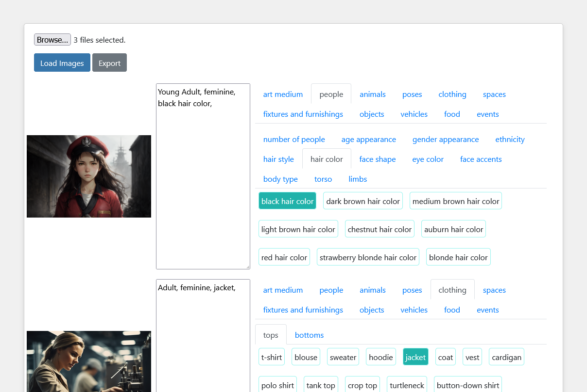

# ImageTagJS
A simple HTML/JS based image tagger - no installation required


ImageTagJS is an image tagging/captioning/annotating software that can be fully run in the browser, no other installations necessary. All you need to do is to supply a folder of images, tag your images and hit export to get a zipped file of your dataset.



## Features
<ul>
    <li>Runs in nearly all modern browsers</li>
    <li>Supports all major image formats.</li>
    <li>Provides a zipped archive of your dataset for easy storage</li>
    <li>Can import image-text dataset pairs to rapidly review auto generated tags</li>
    <li>Built in extensive library of organized tags.</li>
</ul>

## Usage:

For the latest, clone this repository:

```
   git clone https://github.com/Z-L-D/ImageTagJS.git
```

<ol>
    <li>Open index.html in the dist folder with your preferred browser. It should work with the vast majority.</li>
    <li>Press the Browse button and select your image dataset folder.</li>
    <li>You will be prompted by your browser to allow your images to be blobbed into memory. Press Upload. * [Read Here](https://developer.mozilla.org/en-US/docs/Web/API/HTMLInputElement/webkitdirectory) for further details in how this process works.) * </li>
    <li>Press the Load Images button to insert them into the page.</li>
    <li>Beside every image are the Local Tags buttons. Pressing these buttons will add the tag to only the adjacent image. Pressing again will remove the tag from the image.</li>
    <li>After you have tagged your images, press the Export button at the top of the page. This will prompt or automatically download a zip file containing your complete dataset. This process will take several minutes if you have a lot of photos. NOTE: Imported images don't retain their original file names and are renamed a batch number and image number name with an associated text file with the same name. </li>
</ol> 

## Upcoming features
<ul>
    <li>Incorporate smartcrop.js for content aware cropping</li>
    <li>Incorporate pica.js for alias safe downscaling</li>
    <li>Incorporate global tagging as a user generated content area from a text box</li>
    <li>Incorporate an image converter that allows the user to select the exported format - either JPG or PNG - useful for webp images</li>
    <li>Incorporate an easy way to build and modify a custom tag library that can be alternately used instead of the built in library</li>
    <li>Incorporate the ability to load zipped datasets.</li>
    <li>Incorporate checkboxes next to images to allow enabling or disabling inclusion into the dataset.</li>
</ul>

## Current Issues:
<ul>
    <li>Imported tags aren't checked against the tags library</li>
    <li>The current layout does not work well with screens under 1280px wide at this time</li>
    <li>Zipped file should use batch number in filename</li>
</ul>